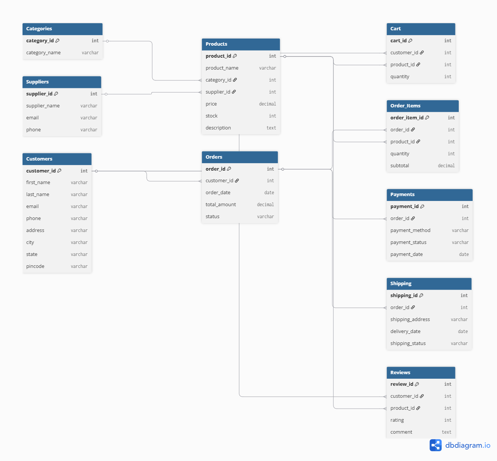

# 🛒 E-Commerce Platform Database Management System

A SQL-based relational database project developed using **MySQL Workbench**. This project simulates the backend database of an E-Commerce platform, managing customers, products, categories, suppliers, shopping carts, orders, payments, shipping, and product reviews.

---

## 📌 Project Overview

The E-Commerce Platform Database Management System is designed to efficiently manage online shopping operations. It demonstrates relational database concepts such as normalization, primary and foreign keys, constraints, and SQL queries for data management and reporting.

---

## 🎯 Objectives

- Design a normalized relational database.
- Implement relationships using Primary and Foreign Keys.
- Perform CRUD (Create, Read, Update, Delete) operations.
- Execute SQL queries using joins, aggregate functions, grouping, and subqueries.
- Demonstrate real-world e-commerce database functionality.

---

## 🛠 Technologies Used

- MySQL 8.0
- MySQL Workbench
- SQL
- Git & GitHub

---

# 📂 Database Schema

The database consists of the following tables:

| Table Name | Description |
|------------|-------------|
| Customers | Stores customer information |
| Categories | Stores product categories |
| Suppliers | Stores supplier information |
| Products | Stores product details |
| Cart | Stores customer shopping cart items |
| Orders | Stores customer orders |
| Order_Items | Stores products within each order |
| Payments | Stores payment details |
| Shipping | Stores shipping information |
| Reviews | Stores customer product reviews |

---

## 📊 Entity Relationship Diagram

```markdown

```

---

## 📁 Project Structure

```
E-Commerce-Database-System/
│
├── database.sql
├── insert_data.sql
├── queries.sql
├── README.md
├── ER_Diagram.png
│
├── screenshots/
│   ├── 01_database.png
│   ├── 02_tables.png
│   ├── 03_customers.png
│   ├── 04_categories.png
│   ├── 05_products.png
│   ├── 06_orders.png
│   ├── 07_payments.png
│   ├── 08_shipping.png
│   ├── 09_join_product_category.png
│   ├── 10_customer_orders.png
│   ├── 11_total_revenue.png
│
└── report/
    └── Project_Report.pdf
```

---

# 🚀 Features

- Customer Management
- Product Management
- Category Management
- Supplier Management
- Shopping Cart Management
- Order Management
- Payment Management
- Shipping Management
- Product Reviews
- SQL Reports
- Business Analysis Queries

---

# 🗄 Database Design Features

- Relational Database Design
- Third Normal Form (3NF)
- Primary Keys
- Foreign Keys
- NOT NULL Constraints
- UNIQUE Constraints
- CHECK Constraints
- AUTO_INCREMENT
- Referential Integrity

---

# 💾 Installation

## 1. Clone Repository

```bash
git clone https://github.com/yourusername/E-Commerce-Database-System.git
```

---

## 2. Open MySQL Workbench

Connect to your local MySQL server.

---

## 3. Execute Database Script

Run:

```sql
database.sql
```

This creates all tables.

---

## 4. Insert Sample Data

Run:

```sql
insert_data.sql
```

---

## 5. Execute Queries

Run:

```sql
queries.sql
```

---

# 📋 SQL Concepts Implemented

- CREATE DATABASE
- CREATE TABLE
- INSERT
- UPDATE
- DELETE
- SELECT
- WHERE
- ORDER BY
- LIMIT
- INNER JOIN
- GROUP BY
- HAVING
- Aggregate Functions
- Subqueries
- Constraints
- Relationships

---

# 📈 Sample SQL Reports

- Display all customers
- Display all products
- Products by category
- Customer order history
- Payment details
- Shipping status
- Total revenue
- Most expensive product
- Highest-rated products
- Products with low stock
- Orders grouped by customer

---

# 📸 Screenshots

The repository includes screenshots demonstrating:

- Database creation
- Tables
- Customer records
- Product records
- Orders
- Payments
- Shipping
- Join queries
- Aggregate queries
- ER Diagram

---

# 🎥 Demonstration Video

A short project demonstration video (3–5 minutes) explaining the database design, implementation, and SQL queries will be included in the project report.

---

# 📚 Learning Outcomes

This project demonstrates:

- Relational database design
- SQL programming
- Data normalization
- Database relationships
- Data retrieval using SQL
- Business reporting with SQL

---

# 👩‍💻 Author

**Simran**

B103 – Databases & Big Data

Gisma University of Applied Sciences

---

# 📄 License

This project is developed for educational purposes as part of the B103 Databases & Big Data module.
